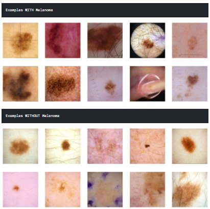

# melanoma-detection
## Problem
> Build a model to classify melanoma skin cancer in images. Binary classification with mixed data input (image+tabular). 
## Dataset
1. Skin images dataset :

2. Tabular features including :
* image_name - unique identifier, points to filename of related DICOM image
* patient_id - unique patient identifier
* sex - the sex of the patient (when unknown, will be blank)
* age_approx - approximate patient age at time of imaging
* anatom_site_general_challenge - location of imaged site
* diagnosis - detailed diagnosis information (train only)
* benign_malignant - indicator of malignancy of imaged lesion

3.Target
cancer/no_cancer
## Approach
Using EfficientNetB1, B2 and B3 in the same network to build a CNN with multiple feature extractors concatenated and fed to one stack of Dense layers. 

